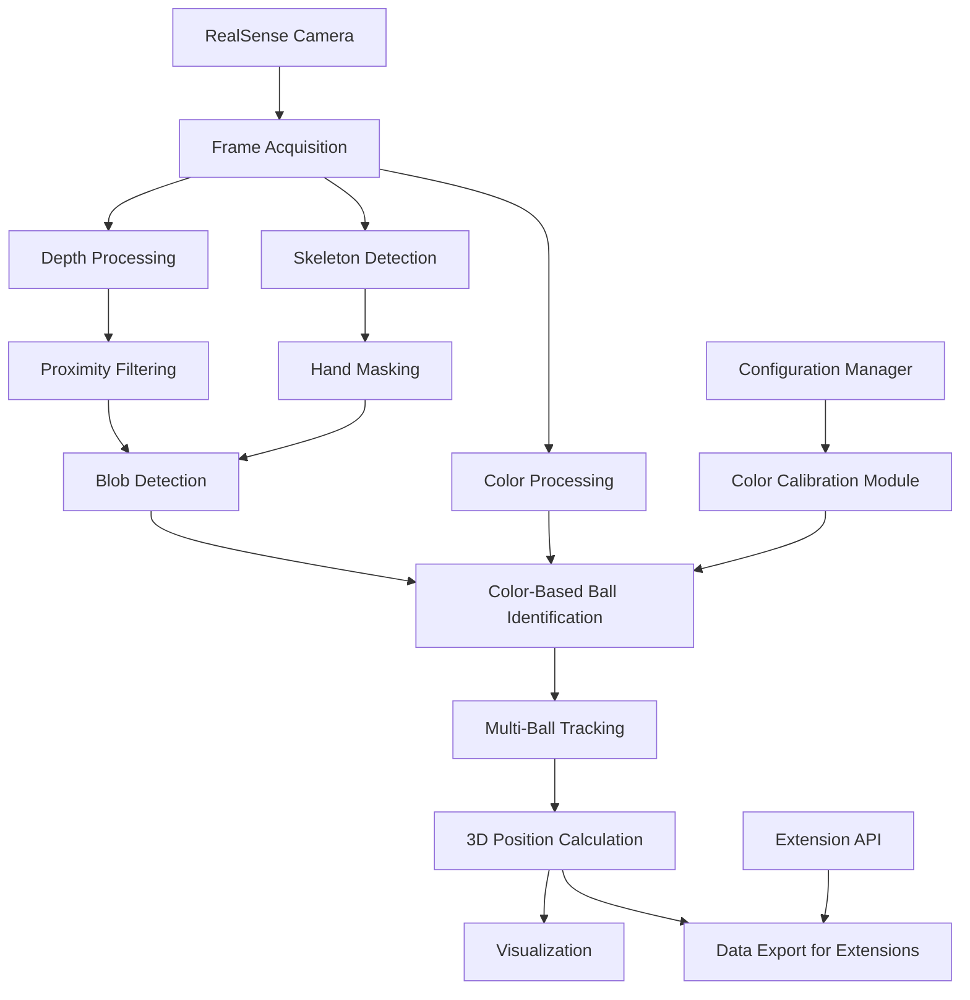

# Juggling Ball Tracking System

## Overview

This document outlines the plan for a robust juggling ball tracking system that uses a RealSense depth camera to track multiple juggling balls and the juggler's hands in real-time. The system is designed to be modular and extensible, allowing for future applications such as siteswap determination, catch counting, and pattern analysis.

## System Architecture

The system is built with a modular architecture that separates concerns and allows for easy extension and modification.

### Core Components



### Class Diagram

```mermaid
classDiagram
    class JugglingTracker {
        -FrameAcquisition frameAcquisition
        -DepthProcessor depthProcessor
        -SkeletonDetector skeletonDetector
        -BlobDetector blobDetector
        -ColorCalibration colorCalibration
        -BallIdentifier ballIdentifier
        -MultiBallTracker ballTracker
        -Visualizer visualizer
        -ConfigManager configManager
        -DataExporter dataExporter
        -ExtensionManager extensionManager
        +run()
        +processFrame()
        +handleUI()
        +registerExtension(extension)
    }
    
    class FrameAcquisition {
        -rs.pipeline pipeline
        -rs.config config
        -rs.align align
        +initialize()
        +getFrames()
        +getIntrinsics()
        +stop()
    }
    
    class DepthProcessor {
        +processDepthFrame(depth_frame)
        +createProximityMask(depth_in_meters)
        +cleanupMask(mask)
    }
    
    class SkeletonDetector {
        -mp.solutions.pose pose
        +detectSkeleton(color_image)
        +getHandPositions(pose_results)
        +createHandMask(hand_positions, image_shape)
    }
    
    class BlobDetector {
        +detectBlobs(mask)
        +filterBySize(contours)
        +filterByCircularity(contours)
        +getBlobProperties(contour)
    }
    
    class ColorCalibration {
        -String name
        -Map~String, ColorInfo~ balls
        +addBall(name, color_sample)
        +updateBallColor(name, color_sample)
        +getBallColor(name)
        +save(filename)
        +load(filename)
    }
    
    class BallIdentifier {
        -ColorCalibration calibration
        +identifyBalls(blobs, color_image)
        +matchBallsToBlobs(blobs, color_image)
        +calculateColorDistance(color1, color2)
    }
    
    class MultiBallTracker {
        -List~BallTracker~ trackers
        +updateTrackers(identified_balls)
        +predictPositions()
        +getTrackedBalls()
        +cleanupLostBalls()
    }
    
    class Visualizer {
        -JugglingTrackerUI ui
        +drawTrackedBalls(frame, tracked_balls)
        +drawHandPositions(frame, hand_positions)
        +drawDebugInfo(frame, debug_info)
        +showFrame(frame)
    }
    
    class ConfigManager {
        +saveConfig(config, filename)
        +loadConfig(filename)
        +getDefaultConfig()
    }
    
    class DataExporter {
        +exportFrameData(tracked_balls, hand_positions)
        +startRecording()
        +stopRecording()
        +saveRecording(filename)
    }
    
    class ExtensionManager {
        -List~Extension~ extensions
        +registerExtension(extension)
        +notifyExtensions(frame_data)
        +getExtensionResults()
    }
    
    class Extension {
        <<interface>>
        +initialize()
        +processFrame(frame_data)
        +getResults()
        +getName()
    }
    
    class SiteswapDetector {
        +initialize()
        +processFrame(frame_data)
        +getDetectedPattern()
        +getConfidence()
    }
    
    class CatchCounter {
        +initialize()
        +processFrame(frame_data)
        +getCatchCount()
        +getDropCount()
    }
    
    JugglingTracker --> FrameAcquisition
    JugglingTracker --> DepthProcessor
    JugglingTracker --> SkeletonDetector
    JugglingTracker --> BlobDetector
    JugglingTracker --> ColorCalibration
    JugglingTracker --> BallIdentifier
    JugglingTracker --> MultiBallTracker
    JugglingTracker --> Visualizer
    JugglingTracker --> ConfigManager
    JugglingTracker --> DataExporter
    JugglingTracker --> ExtensionManager
    BallIdentifier --> ColorCalibration
    Visualizer --> JugglingTrackerUI
    ExtensionManager --> Extension
    SiteswapDetector ..|> Extension
    CatchCounter ..|> Extension
```



## Detailed Component Descriptions

### 1. Frame Acquisition Module
- Handles the RealSense camera setup and frame capture
- Aligns depth and color frames
- Provides access to camera intrinsics for 3D calculations

### 2. Depth Processing Module
- Converts raw depth data to meters
- Creates proximity masks to identify the closest objects (likely to be balls and hands)
- Applies morphological operations to clean up the masks

### 3. Skeleton Detection Module
- Uses MediaPipe Pose for efficient skeleton detection
- Extracts hand positions from the skeleton
- Creates masks to exclude hands from ball detection
- Handles cases where arms may cross

### 4. Blob Detection Module
- Finds contours in the filtered depth mask
- Applies circularity and size filters to identify potential ball candidates
- Provides 2D positions and radii of detected blobs

### 5. Color Calibration Module
- Allows adding new balls by tossing them and automatically detecting their color
- Maintains a database of ball colors with customizable names
- Provides functions to save and load calibrations
- Supports adjusting existing calibrations

### 6. Color-Based Ball Identification Module
- Uses the calibrated colors to identify which blob corresponds to which ball
- Handles cases where balls may be temporarily occluded
- Maintains consistent ball identities across frames

### 7. Multi-Ball Tracking Module
- Uses Kalman filters to track each ball's position and velocity in 3D space
- Handles ball identity assignment and maintenance
- Provides smooth trajectories even with occasional detection failures

### 8. Visualization Module
- Displays the color stream with overlaid ball tracking information
- Shows depth information when needed
- Provides debugging visualizations for development

### 9. Configuration Manager
- Handles saving and loading of color calibrations
- Manages application settings
- Provides a simple UI with a menu bar

### 10. Data Export Module
- Exports ball and hand position data in a format suitable for extensions
- Provides hooks for future extensions

### 11. Extension Manager
- Manages the registration and execution of extensions
- Provides a standardized interface for extensions to access tracking data
- Collects and displays results from extensions

## Technical Implementation Details

### Depth-Based Filtering
We'll use the depth information from the RealSense camera to create a proximity mask that identifies objects within a certain distance range from the camera. This will help narrow down the search space for ball detection.

```python
# Create a proximity mask based on the closest objects
valid_depths = depth_in_meters[depth_in_meters > 0]
min_depth_val = np.min(valid_depths)
delta = 0.15  # margin in meters (adjustable)
proximity_mask = cv2.inRange(depth_in_meters, min_depth_val, min_depth_val + delta)

# Clean up the mask with morphological operations
kernel = np.ones((5, 5), np.uint8)
proximity_mask = cv2.morphologyEx(proximity_mask, cv2.MORPH_OPEN, kernel)
proximity_mask = cv2.morphologyEx(proximity_mask, cv2.MORPH_CLOSE, kernel)
```

### Hand Tracking
We'll use MediaPipe Pose for efficient skeleton detection and extract the hand positions from the skeleton. We'll create masks to exclude the hands from ball detection.

```python
# Extract hand positions from the skeleton
if results.pose_landmarks:
    img_h, img_w, _ = color_image.shape
    left_wrist = results.pose_landmarks.landmark[mp_pose.PoseLandmark.LEFT_WRIST]
    right_wrist = results.pose_landmarks.landmark[mp_pose.PoseLandmark.RIGHT_WRIST]
    
    # Convert normalized coordinates to pixel values
    left_hand_x = int(left_wrist.x * img_w)
    left_hand_y = int(left_wrist.y * img_h)
    right_hand_x = int(right_wrist.x * img_w)
    right_hand_y = int(right_wrist.y * img_h)
    
    # Create hand masks
    hand_mask = np.zeros_like(proximity_mask)
    cv2.circle(hand_mask, (left_hand_x, left_hand_y), 30, 255, -1)
    cv2.circle(hand_mask, (right_hand_x, right_hand_y), 30, 255, -1)
    
    # Exclude hands from proximity mask
    combined_mask = cv2.bitwise_and(proximity_mask, cv2.bitwise_not(hand_mask))
```

### Color Calibration
We'll implement a color calibration system that allows adding new balls by tossing them and automatically detecting their color. The system will maintain a database of ball colors with customizable names.

```python
class BallColorCalibration:
    def __init__(self, name="Default"):
        self.name = name
        self.balls = {}  # Dictionary of ball_name -> color_info
        
    def add_ball(self, ball_name, color_sample):
        # Convert to LAB color space for better color comparison
        lab_color = cv2.cvtColor(np.uint8([[color_sample]]), cv2.COLOR_BGR2LAB)[0][0]
        
        # Store color information
        self.balls[ball_name] = {
            'lab_color': lab_color,
            'color_variance': np.array([10, 10, 10])  # Initial variance
        }
        
    def update_ball_color(self, ball_name, color_sample):
        if ball_name in self.balls:
            lab_color = cv2.cvtColor(np.uint8([[color_sample]]), cv2.COLOR_BGR2LAB)[0][0]
            # Update with weighted average
            current = self.balls[ball_name]['lab_color']
            self.balls[ball_name]['lab_color'] = 0.9 * current + 0.1 * lab_color
            
    def save(self, filename):
        # Save calibration to file
        data = {
            'name': self.name,
            'balls': {name: {'lab_color': ball['lab_color'].tolist(),
                             'color_variance': ball['color_variance'].tolist()}
                      for name, ball in self.balls.items()}
        }
        with open(filename, 'w') as f:
            json.dump(data, f)
            
    def load(self, filename):
        # Load calibration from file
        with open(filename, 'r') as f:
            data = json.load(f)
        self.name = data['name']
        self.balls = {name: {'lab_color': np.array(ball['lab_color']),
                             'color_variance': np.array(ball['color_variance'])}
                      for name, ball in data['balls'].items()}
```

### Multi-Ball Tracking
We'll use Kalman filters to track each ball's position and velocity in 3D space. We'll maintain a list of tracked balls and update their positions based on new detections.

```python
class BallTracker:
    def __init__(self, ball_name, initial_position, initial_color):
        self.ball_name = ball_name
        self.color = initial_color
        self.last_update_time = time.time()
        
        # Initialize Kalman filter (6 state: pos & vel)
        self.kalman = cv2.KalmanFilter(6, 3)
        self.kalman.measurementMatrix = np.hstack((np.eye(3, dtype=np.float32), 
                                                  np.zeros((3, 3), dtype=np.float32)))
        self.kalman.transitionMatrix = np.array([
            [1, 0, 0, 1, 0, 0],
            [0, 1, 0, 0, 1, 0],
            [0, 0, 1, 0, 0, 1],
            [0, 0, 0, 1, 0, 0],
            [0, 0, 0, 0, 1, 0],
            [0, 0, 0, 0, 0, 1]], dtype=np.float32)
        self.kalman.processNoiseCov = np.eye(6, dtype=np.float32) * 1e-2
        self.kalman.measurementNoiseCov = np.eye(3, dtype=np.float32) * 1e-1
        
        # Initialize state
        self.kalman.statePost = np.array([
            initial_position[0], initial_position[1], initial_position[2],
            0, 0, 0], dtype=np.float32).reshape(6, 1)
        
    def update(self, position):
        self.kalman.predict()
        measurement = np.array(position, dtype=np.float32).reshape(3, 1)
        self.kalman.correct(measurement)
        self.last_update_time = time.time()
        
    def get_position(self):
        return self.kalman.statePost[:3].reshape(3)
        
    def get_velocity(self):
        return self.kalman.statePost[3:].reshape(3)
```

### Extension API
We'll implement an extension API that allows for easy integration of additional functionality. Extensions will receive frame data and can provide results that will be displayed in the UI.

```python
class Extension:
    def initialize(self):
        """Initialize the extension."""
        pass
        
    def process_frame(self, frame_data):
        """Process a frame of data.
        
        Args:
            frame_data: A dictionary containing:
                - color_image: The color image
                - depth_image: The depth image
                - tracked_balls: A list of tracked balls with positions and velocities
                - hand_positions: A list of hand positions
                - timestamp: The timestamp of the frame
        """
        pass
        
    def get_results(self):
        """Get the results of the extension.
        
        Returns:
            A dictionary containing the results of the extension.
        """
        return {}
        
    def get_name(self):
        """Get the name of the extension.
        
        Returns:
            The name of the extension.
        """
        return "Extension"
```

## User Interface

The user interface will be simple and intuitive, with a menu bar at the top of the window for file operations and color calibration management.

### Main Window
- The main window will display the color stream with overlaid ball tracking information
- Tracked balls will be highlighted with circles and labeled with their names
- Hand positions will be marked with different symbols
- Extension results will be displayed in a sidebar or overlay

### Menu Bar
- File menu: Load, Save, Save As
- Calibration menu: New Ball, Edit Ball, Remove Ball
- Extensions menu: Enable/Disable extensions, Configure extensions
- View menu: Show/Hide debug information, Change visualization options

### Color Calibration Workflow
1. Select "New Ball" from the Calibration menu
2. Enter a name for the ball
3. Toss the ball back and forth in the camera's view
4. The system will automatically detect the ball and learn its color
5. Confirm the calibration or adjust if needed
6. Repeat for additional balls
7. Save the calibration set with a custom name

## User Instructions

### Installation

1. Install the required dependencies:
   ```
   pip install numpy opencv-python pyrealsense2 mediapipe
   ```

2. Connect the RealSense depth camera to your computer.

3. Run the application:
   ```
   python juggling_tracker.py
   ```

### Basic Usage

1. **Starting the Application**
   - Launch the application using the command above
   - The main window will open, showing the camera feed

2. **Calibrating Balls**
   - Click on "Calibration" in the menu bar, then "New Ball"
   - Enter a name for the ball (e.g., "Red Ball")
   - Toss the ball back and forth in the camera's view
   - The system will automatically detect the ball and learn its color
   - Click "Confirm" when the ball is being tracked correctly
   - Repeat for each ball you want to track

3. **Saving and Loading Calibrations**
   - Click on "File" in the menu bar, then "Save"
   - Enter a name for the calibration set (e.g., "Living Room Lighting")
   - To load a saved calibration, click on "File", then "Load"
   - Select the calibration set you want to load

4. **Tracking Balls**
   - Once calibrated, the system will automatically track the balls
   - Each ball will be highlighted with a circle and labeled with its name
   - Hand positions will be marked with different symbols

5. **Using Extensions**
   - Click on "Extensions" in the menu bar
   - Enable or disable available extensions
   - Configure extension settings if needed
   - Extension results will be displayed in the UI

### Troubleshooting

1. **Camera Not Detected**
   - Make sure the RealSense camera is properly connected
   - Check that the RealSense SDK is installed correctly
   - Try running the test_librealsense2.py script to verify camera functionality

2. **Poor Ball Tracking**
   - Ensure the lighting is adequate and consistent
   - Recalibrate the balls if the lighting conditions have changed
   - Adjust the proximity mask delta if the balls are not being detected

3. **Slow Performance**
   - Reduce the resolution of the camera feed
   - Disable extensions that are not needed
   - Close other applications that may be using system resources

## Extension Points

The system is designed to be extensible, with clear entry points for adding new functionality. Here are some of the key extension points:

### 1. Extension API
- Implement the Extension interface to create new extensions
- Extensions receive frame data and can provide results
- Results can be displayed in the UI

### 2. Data Export
- The DataExporter module provides access to tracking data
- Data can be exported in various formats for external analysis
- Real-time data can be streamed to other applications

### 3. Visualization
- The Visualizer module can be extended to add new visualization options
- Custom overlays can be added to the display
- 3D visualizations can be implemented

### 4. UI
- The UI can be extended to add new controls and displays
- Custom panels can be added for specific extensions
- Keyboard shortcuts can be added for common operations

## Future Extensions

### 1. Siteswap Detection
- Analyze ball trajectories to determine the siteswap pattern
- Implement pattern recognition algorithms
- Provide real-time feedback on the detected pattern

### 2. Catch Counter
- Count successful catches and drops
- Track catch streaks and records
- Provide statistics on juggling performance

### 3. Pattern Consistency Rating
- Analyze the consistency of juggling patterns
- Provide feedback on timing and height consistency
- Generate a score based on pattern quality

### 4. Trick Recognition
- Identify common juggling tricks
- Provide feedback on trick execution
- Track progress in learning new tricks

### 5. Training Mode
- Guide users through juggling exercises
- Provide real-time feedback on technique
- Track progress over time

### 6. Multi-Person Tracking
- Track multiple jugglers simultaneously
- Analyze passing patterns
- Support collaborative juggling analysis

## Implementation Timeline

1. **Phase 1: Core Infrastructure**
   - Set up the project structure
   - Implement the frame acquisition module
   - Implement the depth processing module
   - Implement the blob detection module

2. **Phase 2: Hand Tracking and Ball Identification**
   - Implement the skeleton detection module
   - Implement the color calibration module
   - Implement the ball identification module

3. **Phase 3: Multi-Ball Tracking and UI**
   - Implement the multi-ball tracking module
   - Implement the visualization module
   - Implement the configuration manager and UI

4. **Phase 4: Extension API and Initial Extensions**
   - Implement the extension API
   - Implement the data export module
   - Create sample extensions (e.g., simple catch counter)
   - Test and refine the system

## Conclusion

This plan outlines a robust juggling ball tracking system that uses a RealSense depth camera to track multiple juggling balls and the juggler's hands in real-time. The system is designed to be modular and extensible, allowing for future applications such as siteswap determination, catch counting, and pattern analysis.

By combining depth-based filtering, color tracking, and skeleton detection, the system will be able to accurately track multiple balls even in challenging conditions. The color calibration system will allow for easy adaptation to different lighting conditions and ball colors.

The extension API will provide a clear entry point for adding new functionality, making it easy to build on top of the core tracking system. This will enable a wide range of applications, from simple catch counting to complex pattern analysis.